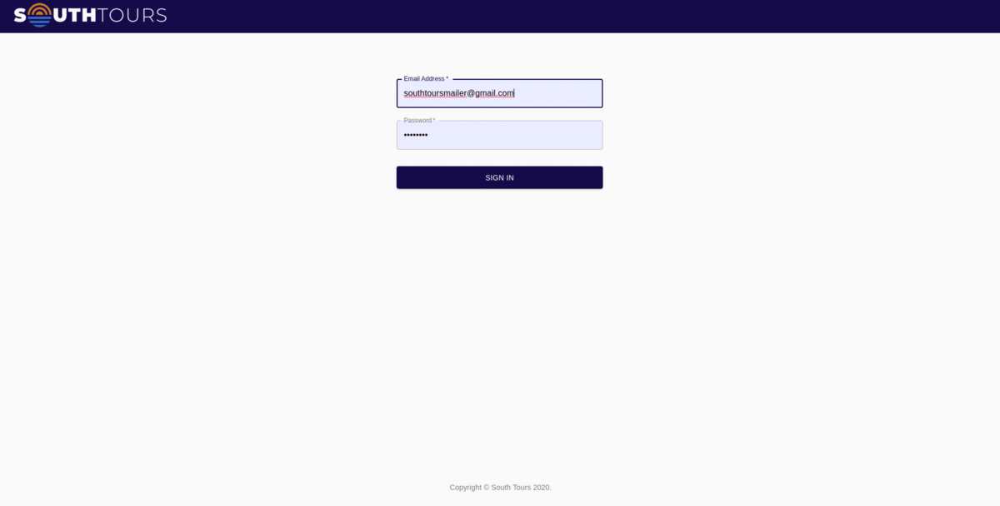

# Rate experience app

## Description:

App includes admin panel and user panel.
On admin panel you can:

1. Authentication is provided by firebase.
2. Write a lists of mails and connect them with the proper experience.
3. Send mails with the request to send experience. User will retrive an mail with unique token, which redirects to the user view.

On the user view:

1. User rate expirience includes: rating (1-5), name, country, city, comment message.
2. The token is valid only once, if token used or not exists - redirect to main website.

## Perview of the application

## Available Scripts

In the project directory, you can run:

### `npm start`

Runs the app in the development mode. 
Open [http://localhost:3000](http://localhost:3000) to view it in the browser.

The page will reload if you make edits. 
You will also see any lint errors in the console.

### `npm run build`

Builds the app for production to the `build` folder. 
It correctly bundles React in production mode and optimizes the build for the best performance.

The build is minified and the filenames include the hashes. 
Your app is ready to be deployed!
